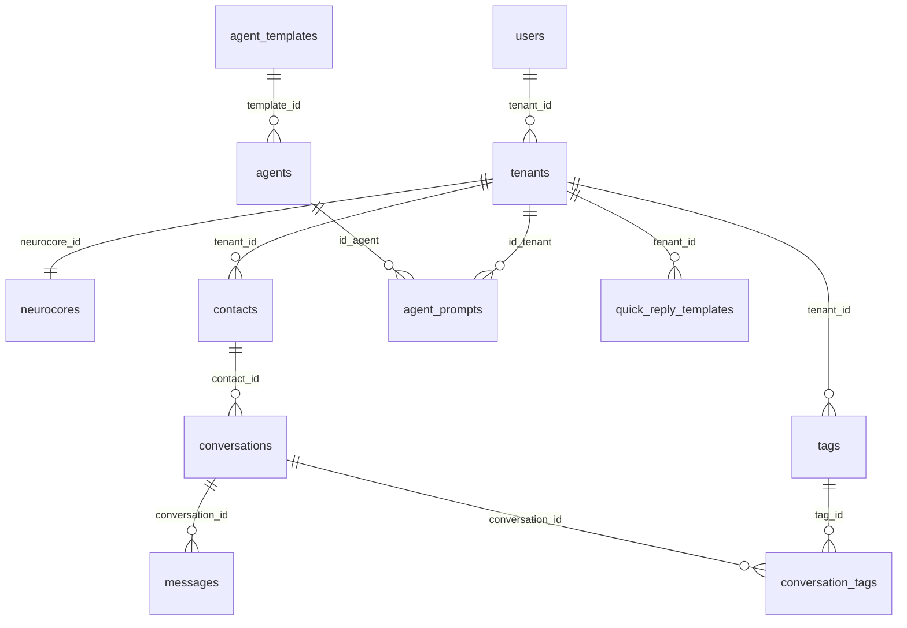

# Database Schema - LIVIA MVP

**Projeto:** LIVIA - Plataforma de IA Conversacional Multi-tenant
**Data:** 2025-12-04
**Versão:** 1.0

---

## 📋 Índice

1. [Visão Geral](#visão-geral)
2. [Diagrama de Relacionamentos](#diagrama-de-relacionamentos)
3. [Tabelas Principais](#tabelas-principais)
4. [Enums](#enums)
5. [RLS Policies](#rls-policies)
6. [Migrations Aplicadas](#migrations-aplicadas)

---

## 🎯 Visão Geral

O banco de dados do LIVIA é uma arquitetura **multi-tenant** com isolamento por RLS (Row Level Security). Principais características:

- **Multi-tenant:** Dados isolados por `tenant_id`
- **Segurança:** RLS em todas as tabelas sensíveis
- **Modular:** Separação clara entre Admin e Tenant
- **Escalável:** Suporta múltiplos neurocores e agents

---

## 📊 Diagrama de Relacionamentos



---

## 📦 Tabelas Principais

### 1. **users** (Usuários do Sistema)

Armazena todos os usuários (Super Admins, Admins, Tenants).

| Coluna | Tipo | Descrição |
|--------|------|-----------|
| `id` | uuid | PK - ID do usuário (auth.uid()) |
| `email` | text | Email único |
| `full_name` | text | Nome completo |
| `role` | enum | Papel: `super_admin`, `admin`, `user` |
| `tenant_id` | uuid | FK → tenants (NULL para super_admins) |
| `modules` | text[] | Módulos habilitados |
| `is_active` | boolean | Status ativo/inativo |
| `whatsapp_number` | text | Número WhatsApp |
| `avatar_url` | text | URL do avatar |
| `ai_paused` | boolean | IA pausada para este usuário |
| `last_sign_in_at` | timestamp | Último login |
| `created_at` | timestamp | Data de criação |
| `updated_at` | timestamp | Última atualização |

**RLS:**
- Tenants veem apenas usuários do próprio tenant
- Super Admins veem todos

---

### 2. **tenants** (Inquilinos/Empresas)

Representa cada empresa/cliente na plataforma.

| Coluna | Tipo | Descrição |
|--------|------|-----------|
| `id` | uuid | PK - ID do tenant |
| `name` | text | Nome da empresa |
| `cnpj` | text | CNPJ |
| `phone` | text | Telefone |
| `plan` | text | Plano contratado |
| `neurocore_id` | uuid | FK → neurocores |
| `niche_id` | uuid | FK → niches (opcional) |
| `is_active` | boolean | Status ativo |
| `master_integration_active` | boolean | Integração master ativa |
| `master_integration_url` | text | URL da integração |
| `responsible_tech_name` | text | Responsável técnico |
| `responsible_tech_email` | text | Email técnico |
| `responsible_tech_whatsapp` | text | WhatsApp técnico |
| `responsible_finance_name` | text | Responsável financeiro |
| `responsible_finance_email` | text | Email financeiro |
| `responsible_finance_whatsapp` | text | WhatsApp financeiro |
| `created_at` | timestamp | Data de criação |
| `updated_at` | timestamp | Última atualização |

**RLS:**
- Usuários veem apenas o próprio tenant
- Super Admins veem todos

---

### 3. **neurocores** (Núcleos de IA)

Configurações centralizadas de IA compartilhadas entre tenants.

| Coluna | Tipo | Descrição |
|--------|------|-----------|
| `id` | uuid | PK - ID do neurocore |
| `name` | text | Nome do neurocore |
| `description` | text | Descrição |
| `is_active` | boolean | Status ativo |
| `created_at` | timestamp | Data de criação |
| `updated_at` | timestamp | Última atualização |

---

### 4. **agents** (Agentes de IA)

Agentes configurados para cada neurocore.

| Coluna | Tipo | Descrição |
|--------|------|-----------|
| `id` | uuid | PK - ID do agent |
| `name` | text | Nome do agent |
| `type` | enum | Tipo: `agent_type_enum` |
| `function` | enum | Função: `agent_function_enum` |
| `template_id` | uuid | FK → agent_templates |
| `persona` | text | Nome da persona |
| `gender` | enum | Gênero da persona |
| `objective` | text | Objetivo do agent |
| `personality_tone` | text | Tom de personalidade |
| `communication_medium` | text | Meio de comunicação |
| `is_intent_agent` | boolean | É agent de intenção |
| `limitations` | jsonb | Limitações do agent |
| `instructions` | jsonb | Instruções gerais |
| `other_instructions` | jsonb | Outras instruções |
| `conversation_roteiro` | jsonb | Roteiro de conversação |
| `associated_neurocores` | uuid[] | Neurocores associados |
| `created_at` | timestamp | Data de criação |
| `updated_at` | timestamp | Última atualização |

**RLS:**
- Tenants veem agents através de `agent_prompts`
- Super Admins veem todos

---

### 5. **agent_templates** (Templates de Agents)

Templates base para criação de agents (Super Admin).

| Coluna | Tipo | Descrição |
|--------|------|-----------|
| `id` | uuid | PK - ID do template |
| `name` | text | Nome do template |
| `type` | enum | Tipo do agent |
| `reactive` | boolean | Modo reativo |
| `limitations` | jsonb | Limitações padrão |
| `instructions` | jsonb | Instruções padrão |
| `guide_line` | jsonb | Guideline/roteiro padrão |
| `persona_name` | text | Nome da persona |
| `age` | text | Idade da persona |
| `gender` | text | Gênero da persona |
| `objective` | text | Objetivo padrão |
| `communication` | text | Estilo de comunicação |
| `personality` | text | Traços de personalidade |
| `is_active` | boolean | Template ativo |
| `created_at` | timestamp | Data de criação |
| `updated_at` | timestamp | Última atualização |

**RLS:**
- Todos veem templates ativos (read-only)
- Super Admins gerenciam (CRUD)

---

### 6. **agent_prompts** (Prompts Personalizados)

Prompts personalizados por tenant para cada agent.

| Coluna | Tipo | Descrição |
|--------|------|-----------|
| `id` | uuid | PK - ID do prompt |
| `id_agent` | uuid | FK → agents |
| `id_tenant` | uuid | FK → tenants (NULL = base) |
| `limitations` | jsonb | Array de limitações |
| `instructions` | jsonb | Array de instruções |
| `guide_line` | jsonb | Estrutura de guideline |
| `rules` | jsonb | Array de regras |
| `others_instructions` | jsonb | Outras instruções |
| `escape` | jsonb | Configuração de escape |
| `fallback` | jsonb | Configuração de fallback |
| `persona_name` | text | Nome da persona |
| `age` | text | Idade |
| `gender` | text | Gênero |
| `objective` | text | Objetivo personalizado |
| `communication` | text | Estilo de comunicação |
| `personality` | text | Traços de personalidade |
| `created_at` | timestamp | Data de criação |
| `updated_at` | timestamp | Última atualização |

**Constraint:**
- `UNIQUE(id_agent, id_tenant)` - Um prompt por agent por tenant

**RLS:**
- Tenants veem seus prompts + prompts base (id_tenant = NULL)
- Tenants editam apenas seus prompts
- Super Admins gerenciam tudo

---

### 7. **contacts** (Contatos/Leads)

Contatos que interagem com o sistema.

| Coluna | Tipo | Descrição |
|--------|------|-----------|
| `id` | uuid | PK - ID do contato |
| `tenant_id` | uuid | FK → tenants |
| `name` | text | Nome do contato |
| `whatsapp_number` | text | Número WhatsApp (único por tenant) |
| `email` | text | Email |
| `status` | text | Status do contato |
| `tags` | text[] | Tags do contato |
| `notes` | text | Notas/observações |
| `created_at` | timestamp | Primeiro contato |
| `updated_at` | timestamp | Última atualização |

**RLS:**
- Tenants veem apenas seus contatos

---

### 8. **conversations** (Conversas)

Conversas entre contatos e o sistema.

| Coluna | Tipo | Descrição |
|--------|------|-----------|
| `id` | uuid | PK - ID da conversa |
| `contact_id` | uuid | FK → contacts |
| `tenant_id` | uuid | FK → tenants |
| `status` | enum | Status: `open`, `closed`, `archived` |
| `last_message_at` | timestamp | Última mensagem |
| `unread_count` | integer | Mensagens não lidas |
| `ai_enabled` | boolean | IA habilitada |
| `created_at` | timestamp | Início da conversa |
| `updated_at` | timestamp | Última atualização |

**RLS:**
- Tenants veem apenas suas conversas

---

### 9. **messages** (Mensagens)

Mensagens trocadas em conversas.

| Coluna | Tipo | Descrição |
|--------|------|-----------|
| `id` | uuid | PK - ID da mensagem |
| `conversation_id` | uuid | FK → conversations |
| `sender_type` | enum | Tipo: `contact`, `agent`, `user` |
| `sender_id` | uuid | ID do remetente |
| `content` | text | Conteúdo da mensagem |
| `media_url` | text | URL de mídia anexa |
| `media_type` | text | Tipo de mídia |
| `is_read` | boolean | Lida ou não |
| `metadata` | jsonb | Metadados extras |
| `created_at` | timestamp | Data de envio |

**RLS:**
- Tenants veem mensagens de suas conversas

---

### 10. **tags** (Tags de Conversas)

Tags para categorização de conversas.

| Coluna | Tipo | Descrição |
|--------|------|-----------|
| `id` | uuid | PK - ID da tag |
| `tenant_id` | uuid | FK → tenants |
| `name` | text | Nome da tag |
| `color` | text | Cor hex (#RRGGBB) |
| `order` | integer | Ordem de exibição |
| `created_at` | timestamp | Data de criação |
| `updated_at` | timestamp | Última atualização |

**Migration:** `007_alter_tags_add_order_color.sql`

---

### 11. **conversation_tags** (Relacionamento N-N)

Relaciona conversas com tags.

| Coluna | Tipo | Descrição |
|--------|------|-----------|
| `conversation_id` | uuid | FK → conversations |
| `tag_id` | uuid | FK → tags |
| `created_at` | timestamp | Data de associação |

**PK:** `(conversation_id, tag_id)`

**Migration:** `006_create_conversation_tags.sql`

---

### 12. **quick_reply_templates** (Respostas Rápidas)

Templates de respostas rápidas para usuários.

| Coluna | Tipo | Descrição |
|--------|------|-----------|
| `id` | uuid | PK - ID do template |
| `tenant_id` | uuid | FK → tenants |
| `title` | text | Título da resposta |
| `content` | text | Conteúdo da resposta |
| `shortcut` | text | Atalho (ex: "/ola") |
| `category` | text | Categoria |
| `is_active` | boolean | Ativo |
| `created_at` | timestamp | Data de criação |
| `updated_at` | timestamp | Última atualização |

**Migration:** `005_alter_quick_reply_templates.sql`

---

## 🔤 Enums

### **access_user_role**
```sql
'super_admin' | 'admin' | 'user'
```

### **agent_type_enum**
```sql
'proactive' | 'reactive'
```

### **agent_function_enum**
```sql
'attendant' | 'intention' | 'in_guard_rails' | 'observer'
```

### **agent_gender_enum**
```sql
'male' | 'female' | 'neutral'
```

### **conversation_status**
```sql
'open' | 'closed' | 'archived'
```

### **sender_type**
```sql
'contact' | 'agent' | 'user'
```

---

## 🔐 RLS Policies

### **agents**

| Policy | Operation | Regra |
|--------|-----------|-------|
| `Tenants can view their own agents` | SELECT | Agents com prompts do tenant |
| `Super Admins have full access to agents` | ALL | role = 'super_admin' |

### **agent_prompts**

| Policy | Operation | Regra |
|--------|-----------|-------|
| `Tenants can view their own prompts` | SELECT | id_tenant = tenant OU id_tenant IS NULL |
| `Tenants can update their own prompts` | UPDATE | id_tenant = tenant |
| `Tenants can insert their own prompts` | INSERT | id_tenant = tenant |
| `Super Admins have full access to agent_prompts` | ALL | role = 'super_admin' |

### **agent_templates**

| Policy | Operation | Regra |
|--------|-----------|-------|
| `Users can view active templates` | SELECT | is_active = true |
| `Super Admins have full access to agent_templates` | ALL | role = 'super_admin' |

### **users, tenants, contacts, conversations, messages**

- **Regra geral:** Usuários veem apenas dados do próprio `tenant_id`
- **Exceção:** Super Admins veem todos os dados

---

## 📝 Migrations Aplicadas

| # | Arquivo | Descrição |
|---|---------|-----------|
| 005 | `alter_quick_reply_templates.sql` | Alterações em quick replies |
| 006 | `create_conversation_tags.sql` | Criação de tags de conversas |
| 007 | `alter_tags_add_order_color.sql` | Adiciona ordem e cor às tags |
| 008 | `add_ai_paused_to_users.sql` | Adiciona flag ai_paused em users |
| 009 | `add_template_id_to_agents.sql` | Adiciona template_id e constraint UNIQUE |
| 009a | `cleanup_agent_prompts_duplicates.sql` | Limpa duplicatas antes do constraint |
| 010 | `add_rls_policies_agents.sql` | Adiciona RLS policies para agents |

---

## 🔍 Queries Úteis

### Verificar RLS Habilitado
```sql
SELECT tablename, rowsecurity
FROM pg_tables
WHERE schemaname = 'public'
AND tablename IN ('agents', 'agent_prompts', 'agent_templates');
```

### Listar Todas as Policies
```sql
SELECT tablename, policyname, cmd, qual
FROM pg_policies
WHERE schemaname = 'public'
ORDER BY tablename, policyname;
```

### Contar Registros por Tenant
```sql
SELECT 
  t.name as tenant,
  COUNT(DISTINCT c.id) as contacts,
  COUNT(DISTINCT cv.id) as conversations,
  COUNT(DISTINCT m.id) as messages
FROM tenants t
LEFT JOIN contacts c ON c.tenant_id = t.id
LEFT JOIN conversations cv ON cv.tenant_id = t.id
LEFT JOIN messages m ON m.conversation_id = cv.id
GROUP BY t.id, t.name;
```

### Verificar Agents por Tenant
```sql
SELECT 
  t.name as tenant,
  a.name as agent,
  ap.id_tenant IS NOT NULL as has_custom_prompt
FROM tenants t
JOIN agent_prompts ap ON ap.id_tenant = t.id
JOIN agents a ON a.id = ap.id_agent;
```

---

## 📚 Referências

- [Supabase RLS Documentation](https://supabase.com/docs/guides/auth/row-level-security)
- [PostgreSQL JSON Types](https://www.postgresql.org/docs/current/datatype-json.html)
- [Migration 010 - RLS Policies](file:///home/frank/projeto/supabase/migrations/010_add_rls_policies_agents.sql)
- [Agent Templates Plan](file:///home/frank/projeto/docs/planejamento/agent-templates-implementation-plan.md)

---

**Última Atualização:** 2025-12-04
**Versão do Schema:** 1.0 (Migration 010)
